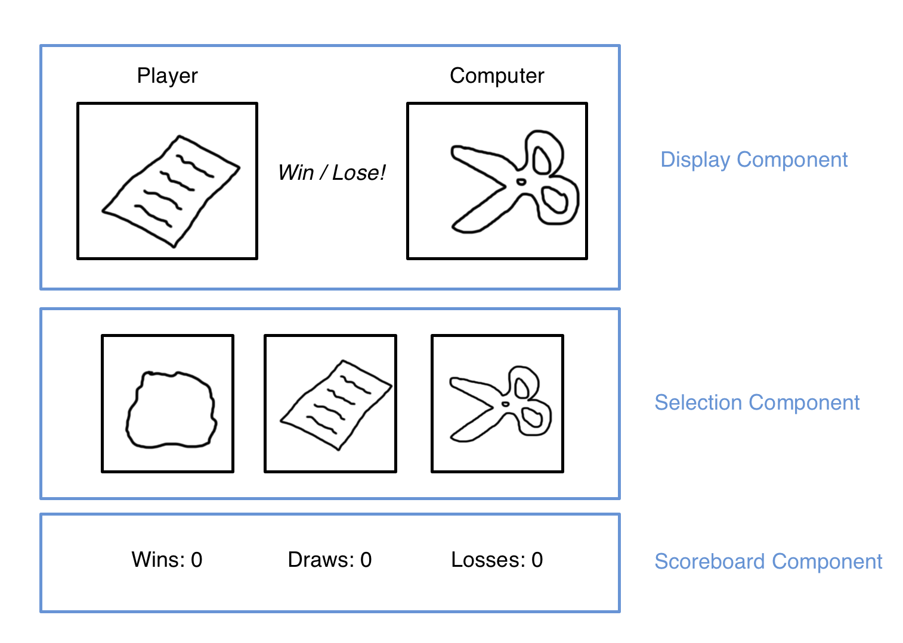

# Rock, Paper, Scissors

## Planning

I plan for all three components to be visible at all times. For UX reasons I might want a cool down of some sort on making throws, but I'm going to leave that out of the plan for now.

### Game Display Component

- State Consumed
  - `userThrow`
  - `computerThrow`
  - `didWin`
- Events
  - None

### Selection Component

- State Consumed
  - None
- Events
  - Buttons will have `click` event handlers that begin simulation of new round.

### Scoreboard Component

- State Consumed
  - `wins`
  - `losses`
  - `draws`
  - Any one of these could be computed from the other two. I don't know which two I'm going to pick yet!
- Events
  - None

### Master List of State

- `throws`: an array to pick throws from.
- `userThrow`: the user's latest throw.
- `computerThrow`: the computer's opposing throw.
- `didWin`: whether the user won (derived from above two).
- `wins`, `losses`, `draws` (possibly one derived from the others).

### Event Handlers

The buttons will have an event handler that will simulate the next round. The handler will update `userThrow`, `computerThrow`, `didWin`, and the game statistics. It will then call the display functions for the the scoreboard and game display components.

### Page Load

Call the display functions to load whatever initial state into the views.

## Attribution

Icons by [font awesome](https://fontawesome.com/).
